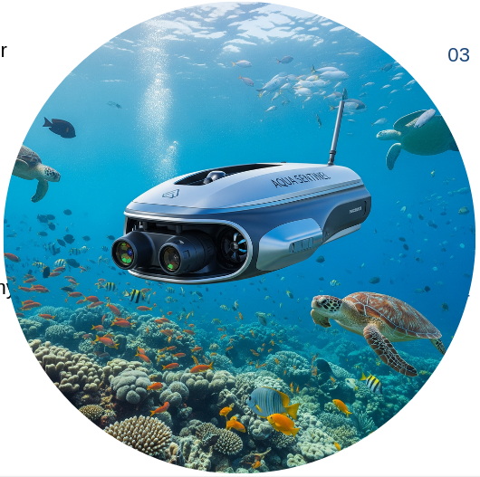

# 🌊 AquaSentinel — AI-Powered Marine Pollution Detection (Frontend)

<p align="center">
  
</p>

<p align="center">
  <em>“AI + Space Tech for a Cleaner Ocean”</em>
</p>

---

## 🎬 Project Demo

> 🎥 Click to play — embedded video (local demo)

<p align="center">
  <video src="src/assets/videos/demo.mp4" controls muted playsinline poster="src/assets/images/debris.png" width="800">
    Sorry, your browser doesn't support embedded videos.
  </video>
</p>

---

## 🌍 Abstract

Marine pollution caused by ship-based dumping is a serious threat to ocean health, marine life, and coastal ecosystems.  
AquaSentinel is an AI-powered surveillance system designed to help identify such pollution events using satellite imagery.

By leveraging Synthetic Aperture Radar (SAR) images for ship detection and optical satellite imagery for marine debris detection, AquaSentinel highlights possible correlations between ships and nearby debris zones — enabling early environmental intervention.

We employ deep learning and Generative AI models trained to identify both ships and floating debris from imagery. Once processed:

- The system overlays detection masks on both image types.
- Users can visualize ship-debris proximity and assess whether a ship caused illegal dumping.
- The user can then generate and send a report (with attached evidence) to the concerned authority.

> ⚖️ AquaSentinel does not impose penalties; its purpose is to support transparent monitoring and accountability, encouraging ships to follow environmentally responsible practices.

The bigger vision is deterrence — when ships know they are being observed and can be held accountable, they are less likely to dump waste illegally.  
This project integrates space technology, AI, and environmental ethics to protect our oceans.

---

## 🧠 Core Workflow

````text
+---------------------+
|  Satellite Images   |
| (SAR + Optical)     |
+---------+-----------+
          |
          v
+---------------------+
| AI Preprocessing    |
| (resize, normalize) |
+---------+-----------+
          |
          v
+----------------------------+
|  Ship Detection Model (ONNX)  |
+----------------------------+
          |
          v
+----------------------------+
| Marine Debris Model (ONNX) |
+----------------------------+
          |
          v
+-----------------------------------+
| Overlay Masks + Generate Results  |
+-----------------------------------+
          |
          v
+---------------------------------------------+
| Frontend Visualization + Report Generation  |
+---------------------------------------------+
          |
          v
+---------------------------------------------+
| Zip + Email Evidence to Authorities         |
+---------------------------------------------+
````

### 🧩 Frontend Tech Stack
````text
| Category      | Technology                                |
| ------------- | ----------------------------------------- |
| Framework     | Vite + React 19                       |
| Styling       | Tailwind CSS v4 (`@tailwindcss/vite`) |
| Animation     | Framer Motion                         |
| Icons         | Lucide-React                          |
| Notifications | React Toastify                        |
| Routing       | React Router v6                       |
| Theme         | Dark/Light/System via Context API     |
````


### 💡 How to Run (Frontend)
## 🧩 Prerequisites
Node.js 18+

npm 9+

### 🖥️ Local Setup
```bash
cd aqua-sentinel-frontend
npm install
npm run dev
````

Vite will start on http://localhost:3000

### 🌓 Dark Mode Support

1. Automatically follows system theme.

2. Users can toggle light/dark manually.

3. Fully styled for both variants (dark: Tailwind utilities).

4. Animations and overlays adjust opacity & color dynamically.

### 🧭 User Flow Summary

1. Upload two images → Ship & Marine Debris

2. Run Detection → AI models process & generate overlays

3. View results side-by-side

4. Download images or Send report

5. A ZIP of all four images (original + result) is attached in report mail.

### 🧠 Design Philosophy

1. Minimal, professional UI inspired by NASA Earth Science dashboards

2. Soft gradients + glowing accent borders

3. Emphasis on clarity and data credibility

4. Completely responsive on mobile/tablet/desktop


### 💬 Future Enhancements

1) 🌐 Real-time detection using live satellite feeds (AWS Open Data)

2) 🚀 ONNX model optimization for faster inference

3) 📡 Integration with marine traffic APIs

4) 🧭 Visual timeline of ship-debris correlations

5) 🛡️ Cloud dashboard for environmental agencies

### 🪸 Impact

“The ocean is a shared responsibility.
AquaSentinel helps us see the invisible - the silent pollution beneath the waves - so we can act before it’s too late.” 🌍
